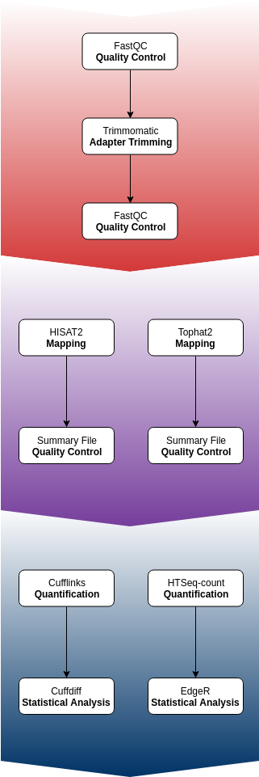

# TranscriptomeAnalysisPipeline_DaphniaUVTolerance
Bash shell scripts for analyzing short paired-end RNA sequence reads for Daphnia UV tolerance treatments.

These scripts are designed to be run from within a script folder, which should be placed in the directory with the .fq.gz files to be processed. In other words, this repository folder (**TranscriptomeAnalysisPipeline_DaphniaUVTolerance**) should be placed in the folder that contains the paired-end RNA sequencing reads intended to be analyzed.

## RNA-seq Analysis Pipeline

## Running Scripts on Servers
- To submit a job to the queue:
**qsub *SCRIPTNAME*.sh**
- To view the jobs you have submitted and corresponding task ID numbers:
**qstat -u *USERNAME***
- To delete a job from the queue:
**qdel *TASKIDNUMBER***

## Running Scripts Locally
- To compile the script before running:
**chmod +x *SCRIPTNAME*.sh**
- To run a compiled script:
**./*SCRIPTNAME*.sh**

## Naming
Each script is named by the action and the primary software needed to perform the action.

## Pipeline Component Scripts
These are scripts that perform a single pipeline operation.

*Quality Control*
- QC_fastqc.sh

*Adapter Trimming*
- trimming_trimmomaticFastqc.sh

*Sequence Alignment*
- alignment_hisat2.sh
- alignment_tophat2.sh

## Pipeline Stage Scripts
These are scripts that perform all operations necessary for a stage of the pipeline.

*Adapter Trimming with Quality Control*
- trimmingQC_trimmomaticFastqc.sh

## Optimized Scripts
These are scripts that have been optimized for running on ND CRC servers using distributed resources.

## Workflow Summary ##
 1. Quality control check a sample with [FastQC][2] to identify the correct adapter library encoding of illumina pipeline used and corresponding phred.
    - If *Encoding = Illumina 1.5*, then the phred score is 64
    - If *Encoding = Illumina 1.9*, then the phred score is 33
 2. Perform adapter trimming with [Trimmomatic][3] for paired-end data with two specified input files, and resulting in 4 output files. Output files consist of 2 files for the paired output where both reads survived the processing, and 2 for corresponding unpaired output where a read survived, but the partner read did not. Adapter trimming is achieved by the
    1. Removal of adapters: *ILLUMINACLIP:/afs/crc.nd.edu/x86_64_linux/bio/Trimmomatic/0.32/adapters/TruSeq3-PE.fa:2:30:10*
    2. Removal of leading low quality bases with a score below 3: *LEADING:3*
    3. Removal of trailing low quality bases with a score below 3: *TRAILING:3*
    4. Scanning of reads with a 4-base wide sliding window and cutting when the average quality per base drops below 12: *SLIDINGWINDOW:4:15*
    5. Dropping of reads below 36 bases long: *MINLEN:36*
    6. Cutting of specified number of bases from the start of the read: *HEADCROP:13*
 3. Quality control check the trimmed paired reads to determine if “reads are good enough” to proceed.
 4. Map trimmed reads using a reference genome to perform sequence alignment with the [HISAT2][5] or [Tophat2][6] packages to
    1. Check the mapping efficiency of each job: *align_summary.txt*
    2. Prepare reads for sorting and counting
 5. Assemble transcripts and quantify samples for differential expression analysis using [Cufflinks][7] or [HTSeq-count][8], depending on chosen statistical analysis package.
 5. Perform statistical analysis by generating read counts with the Tuxedo or [EdgeR][9] pipelines to
    1. Statistically find differences in expression levels
    2. Generate an annotation based on the mapped reads
    3. Perform differential gene expression analysis on the mapped reads: *accepted_hits.bam*

## Required Software ##
- [FastQC][10]: A quality control tool for high throughput raw sequence data. It generates quality reports for NGS data and gives pass/fail results for the following checks: Per base sequence quality, Per sequence quality scores, Per base sequence content, Per base GC content, Per sequence GC content, Per base N content, Sequence length distribution, Sequence duplication levels, Overrepresented sequences, Kmer content. It also has a Graphic User Interface.
- [Trimmomatic][11]: A flexible read trimming tool for Illumina NGS data. It can trim adapter sequences, remove low-quality reads and bases.
- [HISAT2][12]: A fast and sensitive alignment program for mapping next-generation sequencing reads (whole-genome, transcriptome, and exome sequencing data) against the general human population (as well as against a single reference genome). The algorithm is based on HISAT and Bowtie2; uses a graph FM index (GFM) to index the genome before read mapping.
- [Tophat2][13]: A spliced read mapper for RNA-Seq. It aligns RNA-Seq reads to mammalian-sized genomes using the ultra high-throughput short read aligner Bowtie, and then analyzes the mapping results to identify splice junctions between exons.
- [Bowtie2][14]: An ultrafast and memory-efficient tool for aligning sequencing reads to long reference sequences. Bowtie2 first extracts "seed" substrings in reads, aligns seeds in an ungapped way, and then performs extension in a gapped way.
- [Cufflinks][15]: It assembles transcripts, estimates their abundances, and tests for differential expression and regulation in RNA-Seq samples. Assembles transcripts, estimates their abundances, and tests for differential expression and regulation in RNA-Seq samples. It can be used in the pipeline with a protocol paper.
- [Cuffdiff][16]: Differential analysis of gene regulation at transcript resolution with RNA-seq. An algorithm that estimates expression at transcript-level resolution and controls for variability evident across replicate libraries.
- [Samtools][17]: Utilities for the Sequence Alignment/Map (SAM) format. SAMtools has multiple commands for processing SAM/BAM files. The sub-command "SAMtools-flagstat" can be used to print statistics for SAM/BAM files using the FLAG field.
- [HTSeq-count][18]: A package to count mapped reads for genomic features. It counts mapped reads for genomic features.
- [EdgeR][19]: Empirical Analysis of Digital Gene Expression Data. It performs differential expression analysis using read counts. It uses raw count data; implements a range of statistical methodology based on the negative binomial distributions, including empirical Bayes estimation, exact tests, generalized linear models and quasi-likelihood tests.

  [1]: https://files.osf.io/v1/resources/twvc5/providers/osfstorage/5d000f49fea9230019808e67?mode=render
  [2]: https://www.bioinformatics.babraham.ac.uk/projects/fastqc/INSTALL.txt
  [3]: http://www.usadellab.org/cms/?page=trimmomatic
  [4]: http://www.htslib.org/doc/#manual-pages
  [5]: https://ccb.jhu.edu/software/hisat2/manual.shtml#running-hisat2
  [6]: https://ccb.jhu.edu/software/tophat/index.shtml
  [7]: http://cole-trapnell-lab.github.io/cufflinks/cufflinks/index.html
  [8]: https://htseq.readthedocs.io/en/release_0.11.1/counting.html
  [9]: https://bioconductor.org/packages/release/bioc/html/edgeR.html
  [10]: https://www.bioinformatics.babraham.ac.uk/projects/fastqc/INSTALL.txt
  [11]: http://www.usadellab.org/cms/?page=trimmomatic
  [12]: https://ccb.jhu.edu/software/hisat2/manual.shtml#running-hisat2
  [13]: https://ccb.jhu.edu/software/tophat/index.shtml
  [14]: http://bowtie-bio.sourceforge.net/bowtie2/manual.shtml
  [15]: http://cole-trapnell-lab.github.io/cufflinks/cufflinks/index.html
  [16]: http://cole-trapnell-lab.github.io/cufflinks/cuffdiff/
  [17]: http://www.htslib.org/doc/#manual-pages
  [18]: https://htseq.readthedocs.io/en/release_0.11.1/counting.html
  [19]: https://bioconductor.org/packages/release/bioc/html/edgeR.html
