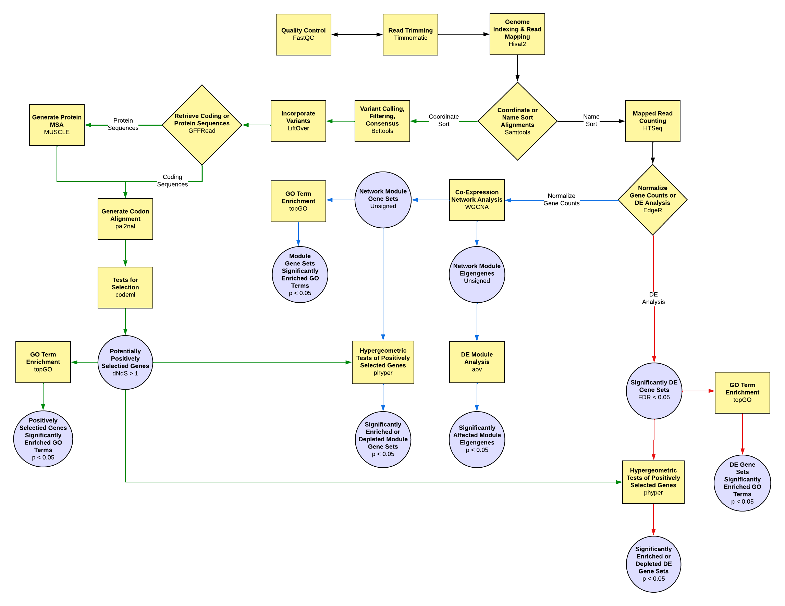

# TranscriptomeAnalysisPipeline_DaphniaUVTolerance
This is a repository for scripts used to analyze short paired-end RNA sequence reads for Daphnia UV tolerance treatments.

## RNA-seq Analysis Pipeline - Genome Guided Assembly

## Running Scripts
* The input and output paths need to be set using the *inputPaths.txt* and *outputPaths.txt* files in the *InputData* directory.
* Be sure to read the *usage notes* at the beginning of the file for any script that you intend to run.

### Running Scripts on Servers
* To submit a BASH job script to the queue: **qsub *SCRIPTNAME*.sh** **INPUT_1 ... INPUT_N**
* To view the jobs you have submitted and corresponding task ID numbers: **qstat -u *USERNAME***
* To delete a job from the queue: **qdel *TASKIDNUMBER***

### Running Scripts Locally
* To run the script: **bash *SCRIPTNAME*.sh** **INPUT_1 ... INPUT_N** 

### Alternative Method of Running Scripts Locally
* To compile the script before running: **chmod +x *SCRIPTNAME*.sh**
* To run a compiled trimming script: **./*SCRIPTNAME*.sh** **INPUT_1 ... INPUT_N** 

## Required Software ##
* [FastQC][10]: A quality control tool for high throughput raw sequence data. It generates quality reports for NGS data and gives pass/fail results for the following checks: Per base sequence quality, Per sequence quality scores, Per base sequence content, Per base GC content, Per sequence GC content, Per base N content, Sequence length distribution, Sequence duplication levels, Overrepresented sequences, Kmer content. It also has a Graphic User Interface.
* [Trimmomatic][11]: A flexible read trimming tool for Illumina NGS data. It can trim adapter sequences, remove low-quality reads and bases.
* [HISAT2][12]: A fast and sensitive alignment program for mapping next-generation sequencing reads (whole-genome, transcriptome, and exome sequencing data) against the general human population (as well as against a single reference genome). The algorithm is based on HISAT and Bowtie2; uses a graph FM index (GFM) to index the genome before read mapping.
* [Tophat2][13]: A spliced read mapper for RNA-Seq. It aligns RNA-Seq reads to mammalian-sized genomes using the ultra high-throughput short read aligner Bowtie, and then analyzes the mapping results to identify splice junctions between exons.
* [Bowtie2][14]: An ultrafast and memory-efficient tool for aligning sequencing reads to long reference sequences. Bowtie2 first extracts "seed" substrings in reads, aligns seeds in an ungapped way, and then performs extension in a gapped way.
* [Cufflinks][15]: It assembles transcripts, estimates their abundances, and tests for differential expression and regulation in RNA-Seq samples. Assembles transcripts, estimates their abundances, and tests for differential expression and regulation in RNA-Seq samples. It can be used in the pipeline with a protocol paper.
* [Cuffdiff][16]: Differential analysis of gene regulation at transcript resolution with RNA-seq. An algorithm that estimates expression at transcript-level resolution and controls for variability evident across replicate libraries.
* [Samtools][17]: Utilities for the Sequence Alignment/Map (SAM) format. SAMtools has multiple commands for processing SAM/BAM files. The sub-command "SAMtools-flagstat" can be used to print statistics for SAM/BAM files using the FLAG field.
* [HTSeq-count][18]: A package to count mapped reads for genomic features. It counts mapped reads for genomic features.
* [EdgeR][19]: Empirical Analysis of Digital Gene Expression Data. It performs differential expression analysis using read counts. It uses raw count data; implements a range of statistical methodology based on the negative binomial distributions, including empirical Bayes estimation, exact tests, generalized linear models and quasi-likelihood tests.

  [1]: https://files.osf.io/v1/resources/twvc5/providers/osfstorage/5d000f49fea9230019808e67?mode=render
  [2]: https://www.bioinformatics.babraham.ac.uk/projects/fastqc/INSTALL.txt
  [3]: http://www.usadellab.org/cms/?page=trimmomatic
  [4]: http://www.htslib.org/doc/#manual-pages
  [5]: https://ccb.jhu.edu/software/hisat2/manual.shtml#running-hisat2
  [6]: https://ccb.jhu.edu/software/tophat/index.shtml
  [7]: http://cole-trapnell-lab.github.io/cufflinks/cufflinks/index.html
  [8]: https://htseq.readthedocs.io/en/release_0.11.1/counting.html
  [9]: https://bioconductor.org/packages/release/bioc/html/edgeR.html
  [10]: https://www.bioinformatics.babraham.ac.uk/projects/fastqc/INSTALL.txt
  [11]: http://www.usadellab.org/cms/?page=trimmomatic
  [12]: https://ccb.jhu.edu/software/hisat2/manual.shtml#running-hisat2
  [13]: https://ccb.jhu.edu/software/tophat/index.shtml
  [14]: http://bowtie-bio.sourceforge.net/bowtie2/manual.shtml
  [15]: http://cole-trapnell-lab.github.io/cufflinks/cufflinks/index.html
  [16]: http://cole-trapnell-lab.github.io/cufflinks/cuffdiff/
  [17]: http://www.htslib.org/doc/#manual-pages
  [18]: https://htseq.readthedocs.io/en/release_0.11.1/counting.html
  [19]: https://bioconductor.org/packages/release/bioc/html/edgeR.html
